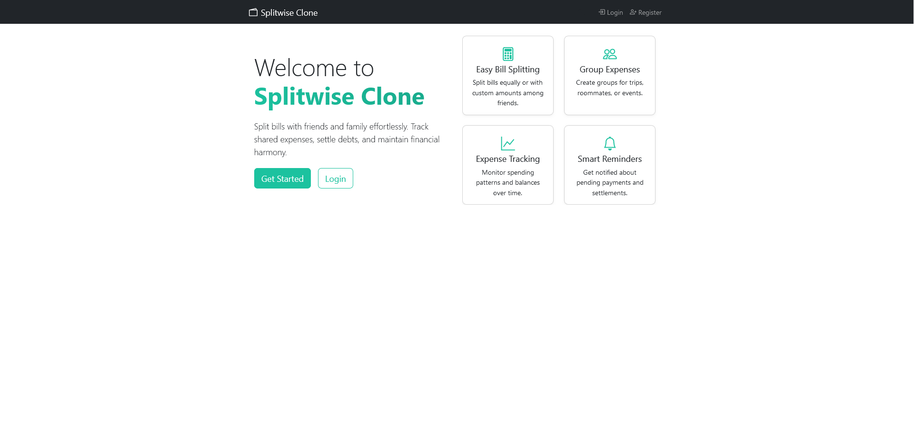
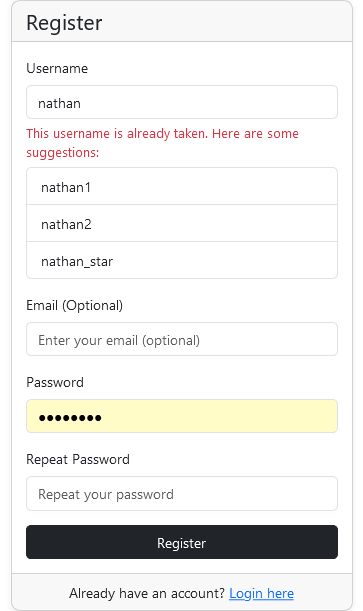
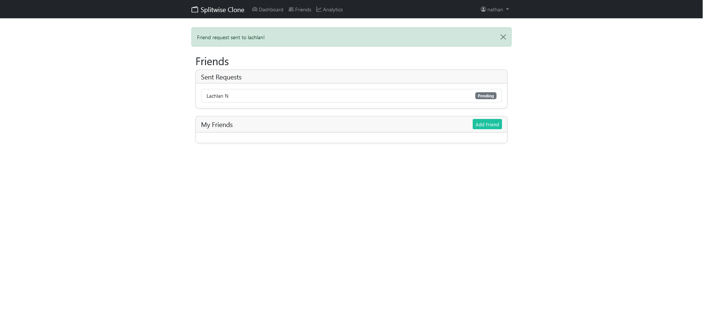
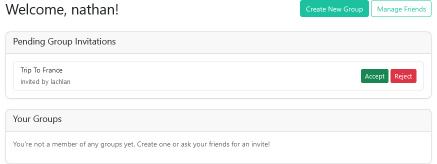
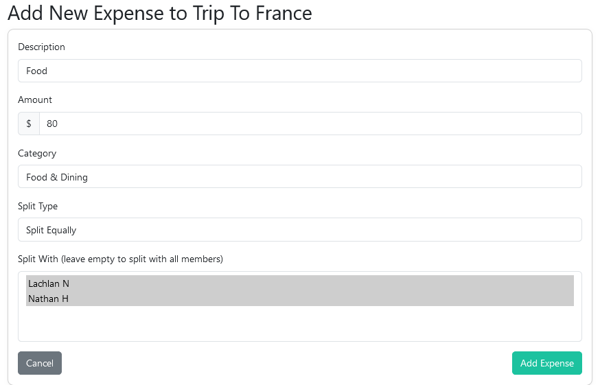
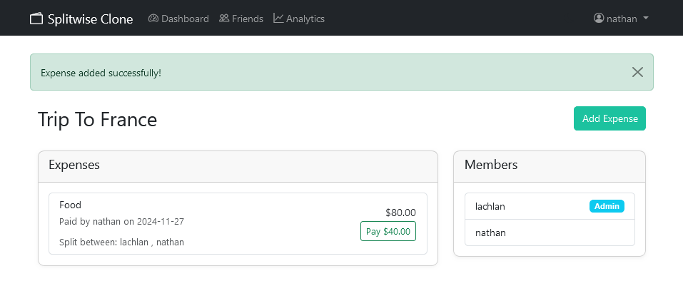

# Learning Base Project: Splitwise Clone

This project was a learning base project to practice database design and SQLAlchemy.

A simple expense-sharing web application built on Flask, SQLite for Backend, and Bootstrap, HTML for Frontend. 

## Demo

### Home Dashboard

*View your expenses, balances, and recent activity*


### Registration

*Create your account to get started*

### Friend Management

*Send and receive friend requests*

### Group Management

*Create groups and invite friends*

### Adding Expenses

*Add new expenses and split them with friends*

### Expense Dashboard

*Track all your expenses in one place*


## What it does

- Track shared expenses with friends
- Create groups for different expense categories
- Split bills equally or with custom amounts
- See who owes what to whom
- Basic analytics to understand spending patterns

## Built with

- Python Flask for the web framework
- SQLite for the database
- SQLAlchemy for database management
- Bootstrap for the user interface
- Flask-Login for user accounts

## Setup

1. Clone the repository
```bash
git clone [repository-url]
cd splitwise-clone
```

2. Set up Python environment
```bash
python -m venv venv
venv\Scripts\activate     # Windows
source venv/bin/activate  # Mac/Linux
```

3. Install required packages
```bash
pip install -r requirements.txt
```

4. Run the app
```bash
flask run
```

## Features

### User Management
- Create an account
- Add friends
- Join groups

### Expense Tracking
- Add new expenses
- Split bills with group members
- Track who paid what
- See your balances

### Groups
- Create groups for different purposes
- Add members to groups
- Track group-specific expenses

## Learning Focus

This project helped me learn:
- How to structure a database with SQLAlchemy
- Managing relationships between different data tables
- Building a basic web application with Flask
- Handling user authentication and sessions

## License

MIT License - Feel free to use this code for learning!
